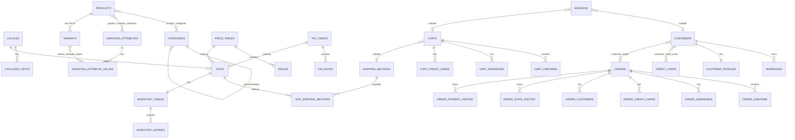

# Entity Model Design — Complete Specification

## Design Principles

1. **Delete Customer** → Orders survive (they're snapshots). Orphaned addresses, credit cards, cart, profile: deleted.
2. **Delete Cart** → Orders unaffected (no link between them).
3. **Order = read-only snapshot** — contains copies of all data. No FK to live catalog, addresses, or cards.
4. **Product ↔ Category** = many-to-many.
5. **Category** = self-referential, flat 2-level max (top → sub → products).
6. **3-tier product model**: Product (simple or master) → Variant → purchasable SKU.
7. **Prices** attach to purchasable SKUs only. No cross-locale fallback. N/A if missing.
8. **Cart line items** do NOT store price — looked up from price table at runtime.
9. **Guest checkout** supported via session + temporary cart addresses/credit cards.
10. **Data Migration:** We do not migrate the live database. The initial import data (e.g. a set of XML files replacing the old single-file approach) must be migrated to fit the new model for initial setup.

---

## SKU Scheme

Format: `[A-Z0-9]{6,10}-[0-9]{4}`

| Type | SKU | Purchasable |
|------|-----|-------------|
| Simple product (no variations) | `XXXXXX-0000` | ✅ |
| Master product (has variations) | `XXXXXX` prefix only, not in price table | ❌ |
| Variant | `XXXXXX-NNNN` (sequential, N ≥ 0001) | ✅ |
| Shipping Method | `SHIP-XXXXX` | ✅ (for price table lookup) |

Master products are **data templates** — variants inherit name, description, images (unless overridden).

---

## 1. Localization

### `locales`

| Field | Type | Notes |
|-------|------|-------|
| `id` | int | PK |
| `locale` | varchar | e.g. `en_US`, `de_DE`, unique |

### `localized_texts`

| Field | Type | Notes |
|-------|------|-------|
| `text_id` | int | group ID (NOT shared across entities — each field gets its own) |
| `locale_id` | int FK → locales | |
| `text` | varchar | |

Composite key: `(text_id, locale_id)`. Fallback is defined per site (see Sites domain).

---

## 2. Product Catalog

### `categories`

| Field | Type | Notes |
|-------|------|-------|
| `id` | int | PK |
| `parent_id` | int FK → categories | nullable. NULL = top category |
| `name_text_id` | int | → localized_texts |
| `description_text_id` | int | → localized_texts |
| `overview_text_id` | int | → localized_texts |

Rule: subcategory (`parent_id` not null) cannot itself have children (enforced in code).

### `products`

| Field | Type | Notes |
|-------|------|-------|
| `id` | int | PK |
| `sku` | varchar(10) | unique prefix |
| `name_text_id` | int | → localized_texts |
| `description_detail_text_id` | int | → localized_texts |
| `description_overview_text_id` | int | → localized_texts |
| `small_image_url` | varchar | |
| `medium_image_url` | varchar | |
| `large_image_url` | varchar | |
| `original_image_url` | varchar | |
| `show_in_carousel` | boolean | |

### `product_categories` (join table)

| Field | Type |
|-------|------|
| `product_id` | int FK → products |
| `category_id` | int FK → categories |

### `variation_attributes`

| Field | Type | Notes |
|-------|------|-------|
| `id` | int | PK |
| `name` | varchar | e.g. "Size", "Finish", "Color" |

### `product_variation_attributes` (join table)

| Field | Type | Notes |
|-------|------|-------|
| `product_id` | int FK → products | |
| `attribute_id` | int FK → variation_attributes | |

### `variation_attribute_values`

| Field | Type | Notes |
|-------|------|-------|
| `id` | int | PK |
| `attribute_id` | int FK → variation_attributes | |
| `value` | varchar | e.g. "16×20", "matte", "red" |

### `variants`

| Field | Type | Notes |
|-------|------|-------|
| `id` | int | PK |
| `product_id` | int FK → products | back to master |
| `variant_number` | int | sequential (≥ 1). Full SKU = `{product.sku}-{padded to 4}` |
| `name_text_id` | int | nullable → localized_texts. Falls back to product if null |
| `description_text_id` | int | nullable → localized_texts. Falls back to product if null |
| `image_url` | varchar | nullable — falls back to product if null |

### `variant_attribute_values` (join table)

| Field | Type |
|-------|------|
| `variant_id` | int FK → variants |
| `attribute_value_id` | int FK → variation_attribute_values |

---

## 3. Pricing

### `price_tables`

| Field | Type | Notes |
|-------|------|-------|
| `id` | int | PK |
| `name` | varchar | e.g. "US Standard" |
| `description` | varchar | |
| `currency` | varchar | e.g. "USD", "EUR" |

A named price container with an explicit currency.

### `prices`

| Field | Type | Notes |
|-------|------|-------|
| `sku` | varchar(15) | purchasable SKU (e.g. "123456-0001") or shipping SKU |
| `price_table_id` | int FK → price_tables | |
| `price` | decimal(10,2) | |

Composite key: `(sku, price_table_id)`. No price = N/A (no fallback across price tables).

---

## 4. Taxes

### `tax_tables`

| Field | Type | Notes |
|-------|------|-------|
| `id` | int | PK |
| `name` | varchar | e.g. "US Default", "Germany Standard" |
| `description` | varchar | |

A named container for tax rates.

### `tax_rates`

| Field | Type | Notes |
|-------|------|-------|
| `tax_table_id` | int FK → tax_tables | |
| `name` | varchar | e.g. "Standard Rate", "Reduced Rate" |
| `rate` | decimal(5,4) | e.g. `0.1900` for 19%, `0.0725` for 7.25% |

Composite key: `(tax_table_id, name)`.

---

## 5. Site

### `sites`

| Field | Type | Notes |
|-------|------|-------|
| `id` | int | PK |
| `name` | varchar | e.g. "United States", "Germany" |
| `description` | varchar | |
| `main_locale_id` | int FK → locales | the primary locale for this site |
| `fallback_locale_id` | int FK → locales | fallback for text lookups when main locale text is missing |
| `currency` | varchar | e.g. "USD", "EUR" |
| `price_table_id` | int FK → price_tables | which prices apply |
| `tax_table_id` | int FK → tax_tables | which taxes apply |
| `prices_are_net` | boolean | default true. If false, localized prices include tax. |

A site is a country definition — it ties a locale, a text fallback, a currency, price/tax tables, and shipping rules together. When assigning a price table to a site, the currencies must match (validated in code).

---

## 6. Shipping & Inventory

### `shipping_methods`

| Field | Type | Notes |
|-------|------|-------|
| `id` | int | PK |
| `sku` | varchar | unique prefix e.g., "SHIP-STD", for price table lookups |
| `name_text_id` | int | → localized_texts |
| `description_text_id` | int | → localized_texts |

### `site_shipping_methods` (join table)

| Field | Type | Notes |
|-------|------|-------|
| `site_id` | int FK → sites | |
| `shipping_method_id` | int FK → shipping_methods | |
| `active` | boolean | |

### `inventory_tables`

| Field | Type | Notes |
|-------|------|-------|
| `id` | int | PK |
| `site_id` | int FK → sites | 1:1 with site |
| `name` | varchar | |

### `inventory_entries`

| Field | Type | Notes |
|-------|------|-------|
| `inventory_table_id` | int FK → inventory_tables | |
| `sku` | varchar | purchasable SKU |
| `available_quantity` | int | |

Composite key: `(inventory_table_id, sku)`. Simple transactional delta tracking. If sku missing = out of stock.

---

## 7. Customer

### `customers`

| Field | Type | Notes |
|-------|------|-------|
| `id` | uuid | PK |
| `email` | varchar | unique |
| `first_name` | varchar | |
| `middle_name` | varchar | optional |
| `last_name` | varchar | |
| `created_at` | timestamp | |

### `customer_profiles` (1:1 with customer)

| Field | Type | Notes |
|-------|------|-------|
| `id` | int | PK |
| `customer_id` | uuid FK → customers | unique |
| `password` | varchar | bcrypt hash |
| `last_login` | timestamp | |
| `last_password_change` | timestamp | |
| `failed_login_attempts` | int | reset on successful login |
| `last_login_attempt` | timestamp | last login attempt (success or failure) |

### `addresses`

| Field | Type | Notes |
|-------|------|-------|
| `id` | int | PK |
| `customer_id` | uuid FK → customers | |
| `recipient_first_name` | varchar | |
| `recipient_last_name` | varchar | |
| `company` | varchar | optional |
| `address_line_1` | varchar | street |
| `address_line_2` | varchar | optional (unit/apt) |
| `city` | varchar | |
| `state` | varchar | region/province |
| `postal_code` | varchar | alphanumeric |
| `country` | varchar | |
| `phone` | varchar | courier notifications |

No type discriminator. Billing vs shipping is determined by usage context (cart/checkout).

### `credit_cards` (standalone — linked via join table)

| Field | Type | Notes |
|-------|------|-------|
| `id` | int | PK |
| `number` | varchar | PCI masked: `123456******7890` |
| `vendor` | varchar | Visa, Mastercard, Amex |
| `name` | varchar | cardholder |
| `exp_month` | int | |
| `exp_year` | int | |

### `customer_credit_cards` (join table)

| Field | Type |
|-------|------|
| `customer_id` | uuid FK → customers |
| `credit_card_id` | int FK → credit_cards |

### `customer_orders` (join table)

| Field | Type |
|-------|------|
| `customer_id` | uuid FK → customers |
| `order_id` | uuid FK → orders |

On customer deletion: join rows deleted, orders survive. Orphaned credit cards, addresses, cart, profile: deleted.

---

## 6. Session

### `sessions`

| Field | Type | Notes |
|-------|------|-------|
| `id` | varchar/uuid | PK (session token) |
| `customer_id` | uuid FK → customers | nullable |
| `cart_id` | uuid FK → carts | nullable (created on first add-to-cart) |
| `anonymous` | boolean | true = no customer context yet (guest browsing) |
| `authenticated` | boolean | true = customer has logged in legitimately |
| `authenticated_at` | timestamp | when authentication occurred |
| `created_at` | timestamp | |
| `last_accessed_at` | timestamp | |

Locale is NOT stored here — it comes from the URL state at request time.

Session states:
- **Anonymous** (`anonymous=true, authenticated=false, customer_id=null`): brand new visitor
- **Identified** (`anonymous=false, authenticated=false, customer_id=set`): user known but not yet authenticated
- **Authenticated** (`anonymous=false, authenticated=true, customer_id=set`): fully logged in

---

## 9. Cart

### `carts`

| Field | Type | Notes |
|-------|------|-------|
| `id` | uuid | PK |
| `price_table_id` | int FK → price_tables | active price table |
| `shipping_address_id` | int FK → cart_addresses | nullable |
| `billing_address_id` | int FK → cart_addresses | nullable |
| `credit_card_id` | int FK → cart_credit_cards | nullable |
| `shipping_method_id` | int FK → shipping_methods | nullable |
| `shipping_costs` | decimal(10,2) | |
| `sub_total` | decimal(10,2) | |
| `tax_rate` | decimal(5,4) | |
| `total_tax` | decimal(10,2) | |
| `total` | decimal(10,2) | |

### `cart_lineitems`

| Field | Type | Notes |
|-------|------|-------|
| `id` | int | PK |
| `cart_id` | uuid FK → carts | |
| `sku` | varchar | purchasable SKU |
| `quantity` | int | |

No price stored — looked up from cart's price table at display time.

### `cart_addresses` (temporary checkout addresses)

| Field | Type | Notes |
|-------|------|-------|
| `id` | int | PK |
| `cart_id` | uuid FK → carts | |
| `recipient_first_name` … `phone` | | same fields as `addresses` |

### `cart_credit_cards` (temporary checkout CC)

| Field | Type | Notes |
|-------|------|-------|
| `id` | int | PK |
| `cart_id` | uuid FK → carts | |
| `number` … `exp_year` | | same fields as `credit_cards` |

---

## 8. Orders (read-only snapshots)

### `orders`

| Field | Type | Notes |
|-------|------|-------|
| `id` | uuid | PK (internal) |
| `order_number` | varchar | **customer-facing, mandatory, unique** |
| `currency` | varchar | e.g. "USD", "EUR" — snapshotted from locale |
| `order_date` | timestamp | |
| `order_state` | varchar | current state (denormalized from history) |
| `payment_state` | varchar | current state (denormalized from history) |
| `shipping_method_sku` | varchar | |
| `shipping_method_name` | varchar | snapshot |
| `shipping_costs` | decimal(10,2) | |
| `sub_total` | decimal(10,2) | |
| `tax_rate` | decimal(5,4) | |
| `total_tax` | decimal(10,2) | |
| `total` | decimal(10,2) | |

### `order_customers` (snapshot)

| Field | Type |
|-------|------|
| `id` | int |
| `order_id` | uuid FK → orders |
| `email` | varchar |
| `first_name`, `middle_name`, `last_name` | varchar |

### `order_addresses` (snapshot — 2 rows per order)

| Field | Type |
|-------|------|
| `id` | int |
| `order_id` | uuid FK → orders |
| `type` | varchar (SHIPPING / BILLING) |
| `recipient_first_name` … `phone` | same fields as `addresses` |

### `order_credit_cards` (snapshot)

| Field | Type |
|-------|------|
| `id` | int |
| `order_id` | uuid FK → orders |
| `number` … `exp_year` | same fields as `credit_cards` |

### `order_lineitems` (snapshot with price)

| Field | Type | Notes |
|-------|------|-------|
| `id` | int | PK |
| `order_id` | uuid FK → orders | |
| `sku` | varchar | full SKU |
| `product_name` | varchar | |
| `variant_description` | varchar | e.g. "16×20, matte" |
| `image_url` | varchar | |
| `quantity` | int | |
| `unit_price` | decimal(10,2) | snapshotted |
| `total_price` | decimal(10,2) | unit_price × quantity |

### `order_state_history`

| Field | Type |
|-------|------|
| `id` | int |
| `order_id` | uuid FK → orders |
| `old_state` | varchar (nullable) |
| `new_state` | varchar |
| `changed_at` | timestamp |

States: created, new, in_progress, shipped, returned, cancelled, rejected

### `order_payment_history`

| Field | Type |
|-------|------|
| `id` | int |
| `order_id` | uuid FK → orders |
| `old_state` | varchar (nullable) |
| `new_state` | varchar |
| `changed_at` | timestamp |

States: authorized, captured, paid, refunded, cancelled

---

## ER Diagram

---

## Table Count Summary

| Domain | Tables |
|--------|--------|
| Localization | `locales`, `localized_texts` |
| Product Catalog | `categories`, `products`, `product_categories`, `variation_attributes`, `product_variation_attributes`, `variation_attribute_values`, `variants`, `variant_attribute_values` |
| Pricing | `price_tables`, `prices` |
| Taxes | `tax_tables`, `tax_rates` |
| Site | `sites` |
| Shipping & Inventory | `shipping_methods`, `site_shipping_methods`, `inventory_tables`, `inventory_entries` |
| Customer | `customers`, `customer_profiles`, `addresses`, `credit_cards`, `customer_credit_cards`, `customer_orders` |
| Session | `sessions` |
| Cart | `carts`, `cart_lineitems`, `cart_addresses`, `cart_credit_cards` |
| Orders | `orders`, `order_customers`, `order_addresses`, `order_credit_cards`, `order_lineitems`, `order_state_history`, `order_payment_history` |
| **Total** | **36 tables** |
