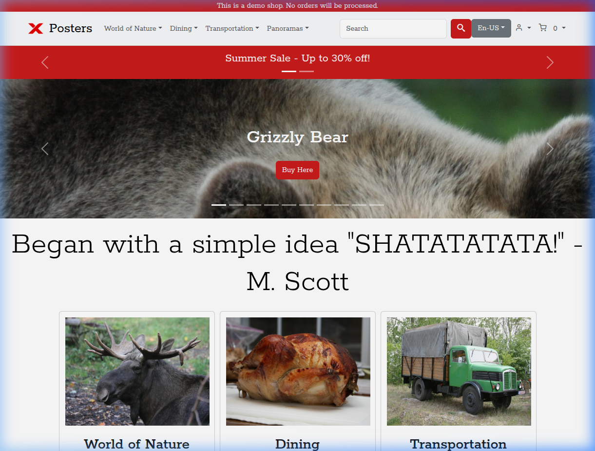
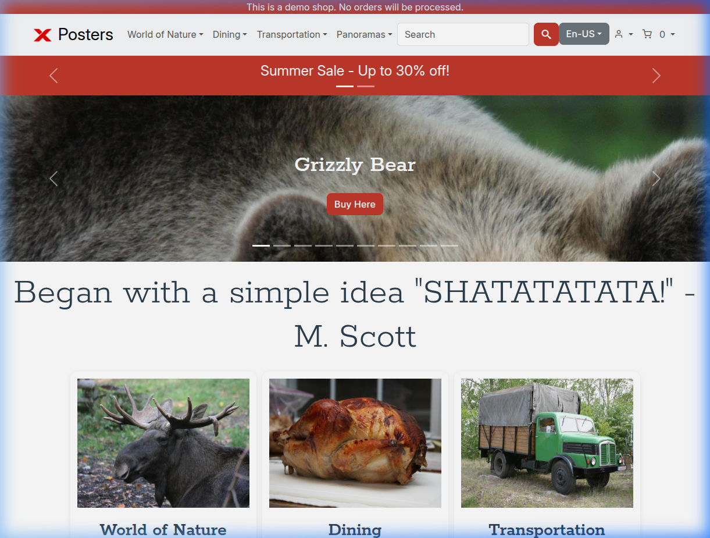
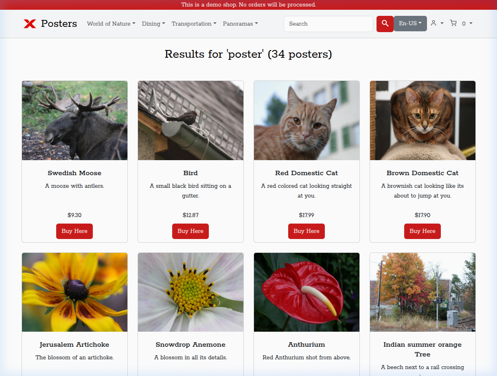
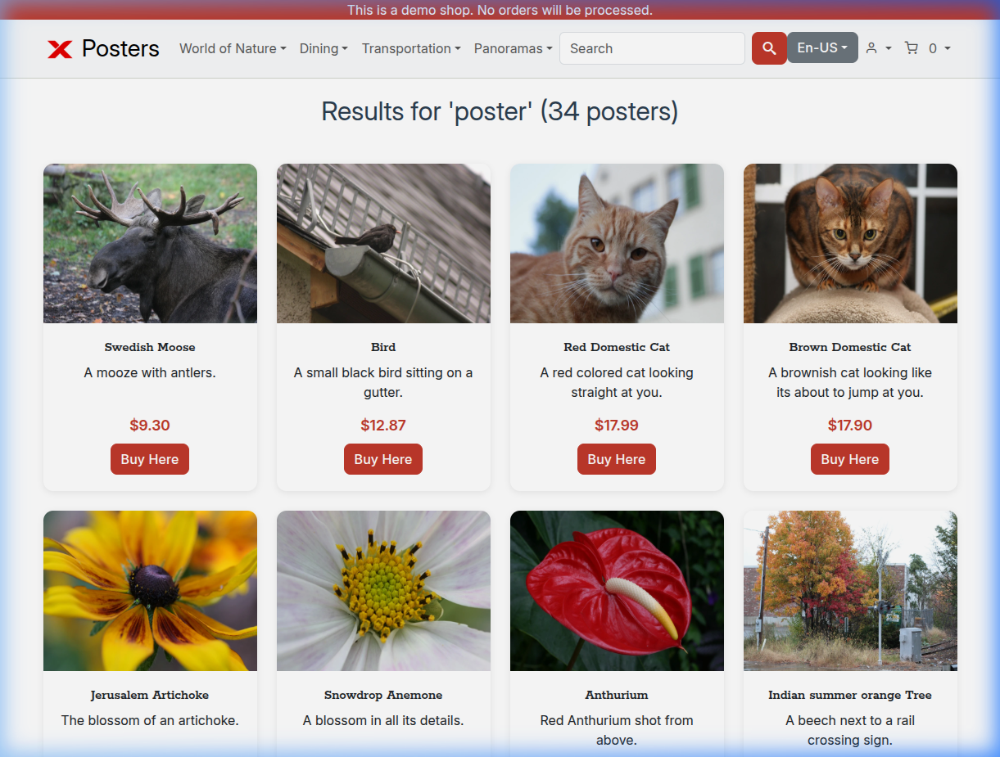
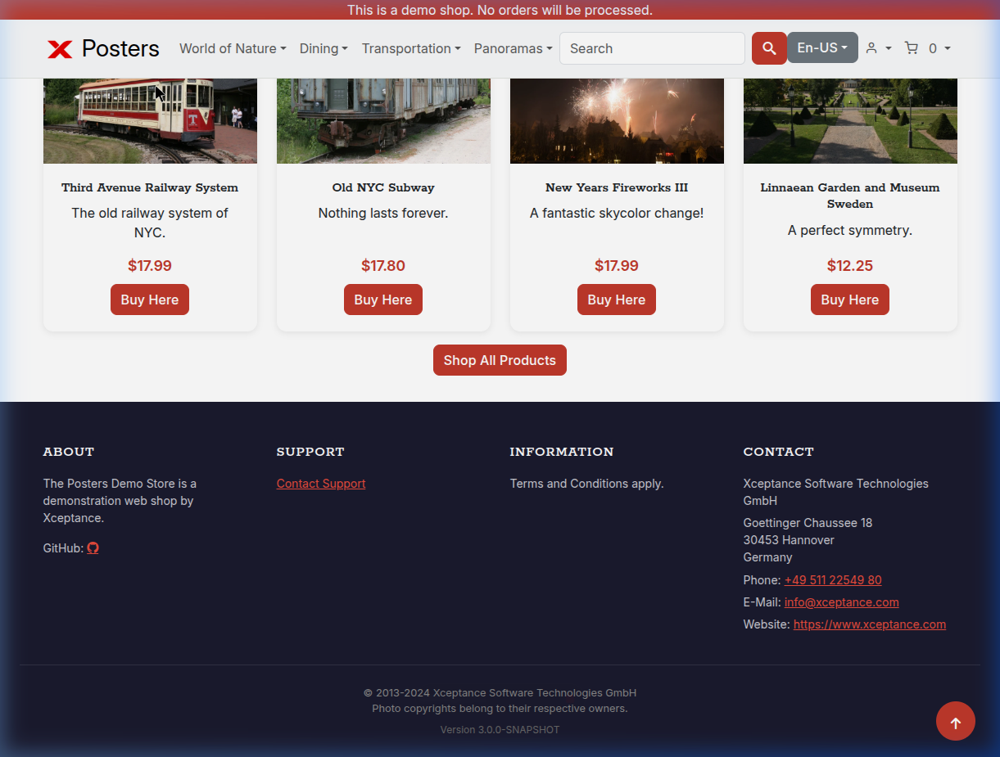
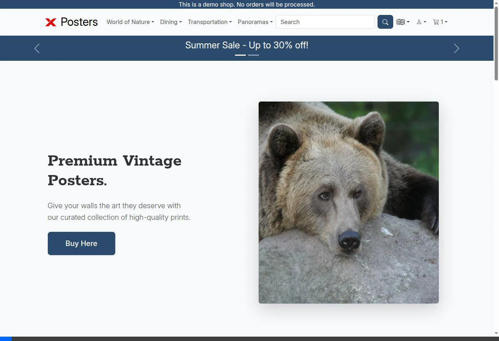

# Walkthrough: UI Modernization

## Changes Made

| # | Improvement | Detail |
|---|---|---|
| 1 | **Body font → Inter** | Variable font, open source (SIL OFL), served locally via woff2+ttf |
| 2 | **Card hover effects** | Shadow lift (`translateY(-4px)`) + deeper shadow on hover |
| 3 | **Refined palette** | `#cb1b1b` → `#c0392b`, text `#2c3e50`, prices highlighted in red |
| 4 | **Smooth transitions** | `0.3s ease` on cards, buttons, links via `--transition-base` |
| 5 | **Rounded buttons** | `border-radius: 0.5rem`, hover shadow + slight lift |
| 6 | **Image hover zoom** | `scale(1.05)` on product/category card images |
| 7 | **Hero gradient overlay** | Bottom-to-top gradient on carousel for text readability |
| 8 | **Dark footer** | Navy `#1a1a2e` background, white headings, improved spacing |
| 9 | **Sticky header** | `position: sticky` with `backdrop-filter: blur(10px)` |

## Before / After

### Homepage

````carousel

<!-- slide -->

````

### Search Results

````carousel

<!-- slide -->

````

### Dark Footer



## Files Changed

| File | Change |
|---|---|
| `src/main/resources/static/css/style_reworked.css` | All CSS improvements |
| `src/main/resources/static/fonts/inter/` | Inter variable font files (woff2 + ttf + LICENSE) |

## Branch & Commit

- **Branch**: `feature/ui-modernization`
- **Commit**: `4ff7049d` — 6 files changed, 229 insertions, 19 deletions

## Homepage Redesign Update

We completely redesigned the homepage to match the new typography and visual language:
1. **Split Layout Hero:** Replaced the old carousel with a modern, high-conversion split layout.
2. **Category Cards:** Converted basic text links to rich, image-backed category cards with overlay gradients.
3. **Trust Band:** Added a new 3-column value proposition band (Free Shipping, Quality, Returns).
4. **Trending Now:** Better spaced product grid with updated headers and typography.


